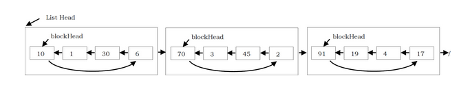

# Unrolled Linked List
Stores multiple elements in each node (called a block). Each block contains a circular linked list. All blocks, except the last one, should contain |√n| elements. The average runtime for operations is therefore Θ(√n). Below is a visual representation.

